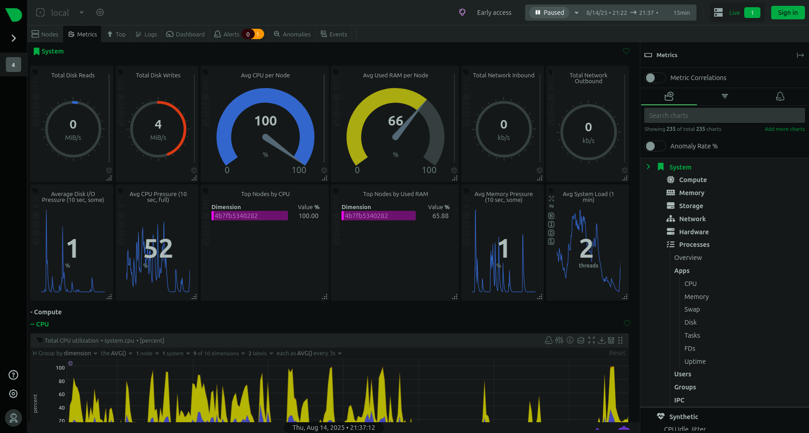

# netdata-docker-monitoring-project

## Overview

This project provides simple, step-by-step instructions for monitoring your system and applications using Netdata, a free, open-source tool running in a Docker container. It helps you visualize real-time CPU, memory, disk, and network usage—all from a modern web dashboard.

## Prerequisites

  - Docker installed on your system (Linux, macOS, or Windows)
  - Internet connection (for downloading the Netdata image)

## Quick Start

1. Run Netdata in Docker

Open a terminal and start Netdata:

`docker run -d --name=netdata -p 19999:19999 netdata/netdata`

  - -d runs in detached mode.

  - --name=netdata sets the container name.

  - -p 19999:19999 exposes the dashboard.

2. Access Netdata Dashboard

Open your browser and go to:

[http://localhost:19999](http://localhost:19999)

  - For remote servers: replace localhost with your server’s IP.

3. Monitor Metrics

  - Explore real-time CPU, RAM, disk, and network statistics.

  - View charts and system health alerts.

  - For further details on alerts, check the Alerts panel in the dashboard.

4. View Logs (If Needed)

If running Netdata in Docker, view logs using:

`docker logs netdata`

    - To access detailed logs, you need to map /var/log/netdata from the container to your host

5. Stop & Remove Netdata Container

To stop and remove:

`docker stop netdata`
`docker rm netdata`

## Purpose of docker-compose.yml

This `docker-compose.yml` file is provided to simplify the deployment of Netdata using Docker Compose. It allows you to start Netdata for system monitoring with a single command, ensuring all necessary configuration and persistent storage options are handled automatically. This setup is ideal for fast, repeatable deployments in development or production environments.

## Netdata Dashboard Screenshot

## Netdata Running Metrics screenshot

## Author
S NAGAVEENA

